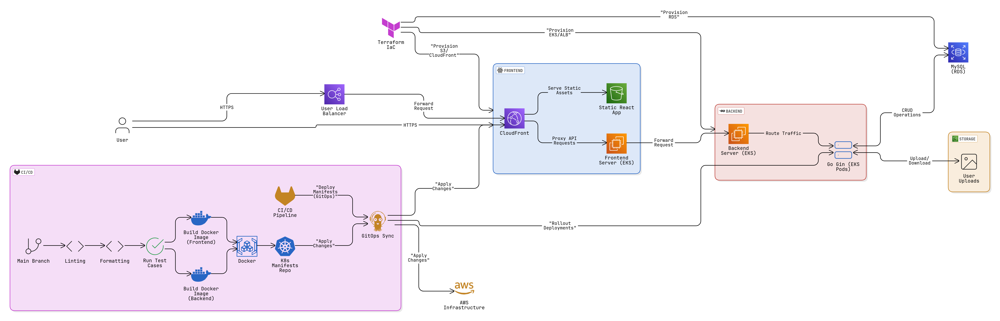

# CloudOps Project — Full-Stack App Deployment with GitOps, CI/CD & AWS

This project demonstrates a **production-grade full-stack web application** deployed using **AWS**, **Kubernetes (EKS)**, **GitHub Actions**, **ArgoCD**, **Terraform**, and other DevOps best practices. It is designed to showcase scalable, automated, and observable cloud infrastructure.

---

## Architecture

> The system consists of a **React frontend**, **Go backend (Gin)**, and **MySQL database** on AWS, powered by GitOps and CI/CD pipelines.

---

## Core Components

### Frontend (React)

- Deployed to an **S3 bucket** and served via **CloudFront**.
- Also deployed as a containerized app on **EKS (EC2)** for SSR or dynamic needs.
- Exposed via **AWS Load Balancer**.

### Backend (Go Gin)

- Containerized **Go Gin** service running as **pods in EKS**.
- Connects with RDS and S3 for data and media storage.
- Receives traffic from the frontend and routes internally.

### Database & Storage

- **MySQL (RDS)** for persistent data storage.
- **AWS S3** for user media uploads (images, files, etc.).

---

## CI/CD & GitOps

### Github Actions

- On every push to `main`:
  - Linting
  - Formatting
  - Test execution
  - Docker image builds (frontend & backend)
  - Push to Docker registry
  - Update Kubernetes manifests repo (Kustomize)

### ArgoCD (GitOps)

- Monitors the manifests repo.
- Automatically syncs & deploys apps to **EKS**.
- Ensures environment matches Git state (declarative).

---

## Infrastructure as Code

- Managed using **Terraform**:
  - VPC, Subnets
  - Internet Gateway, NAT Gateway
  - EKS cluster, node groups
  - RDS instances
  - S3 buckets
  - CloudFront distributions
  - Load Balancers
  - EC2
  - IAM roles & policies

---
